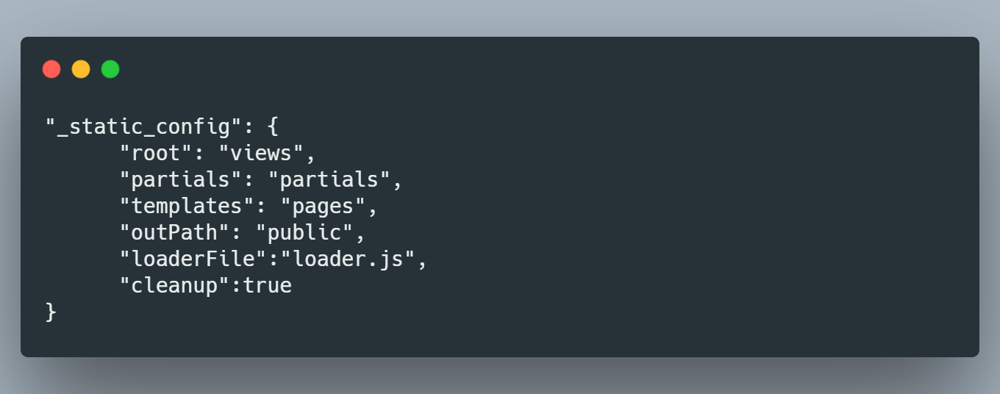
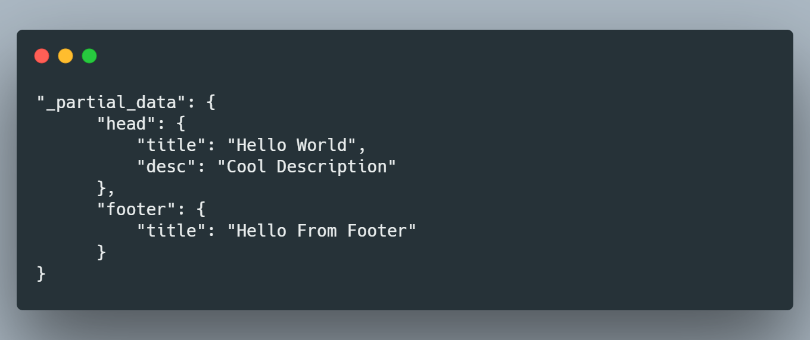
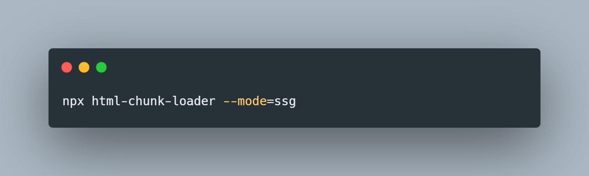

# CLI Reference

## Configuration

In your package.json, you can define the paths for your input & exports like so. If you don't define one, this is what will be created for you in this format. If you haven't changed any defaults, you can omit this declaration (apart from outPath).  You must also set the loaderFile property to direct the build script to your [data file](https://github.com/abschill/html-chunk-loader/blob/master/loader.js). The path will be relative to package.json, so if it's within a nested directory, just add the path to get added after the current working directory of the process. The cleanup property decides whether or not to clear the target outDir on build or not. If you have anything important in that folder DO NOT set this to true, or you will have to restore from recycle bin. 

You will want to declare your partials in package.json as well, in this format per namespace (mapped to filename in partials folder). This will also work as _partialInput in the base constructor if you don't set it. 

## Building your templates

Base Command to build your SSG Templates with all your configs. 

