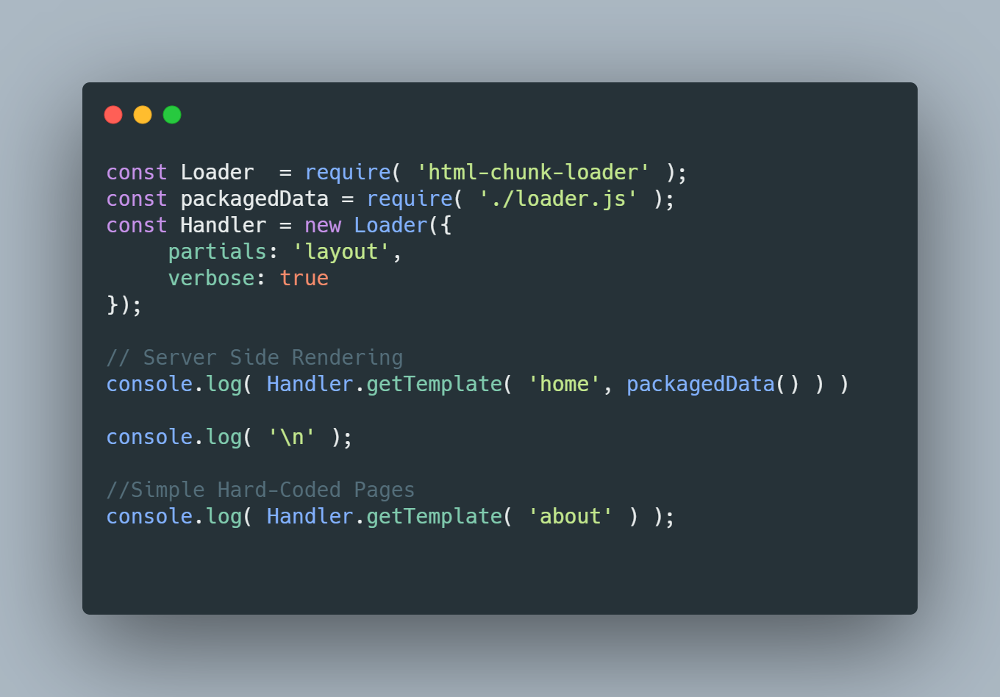
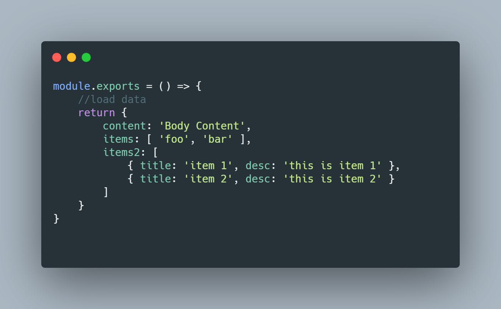
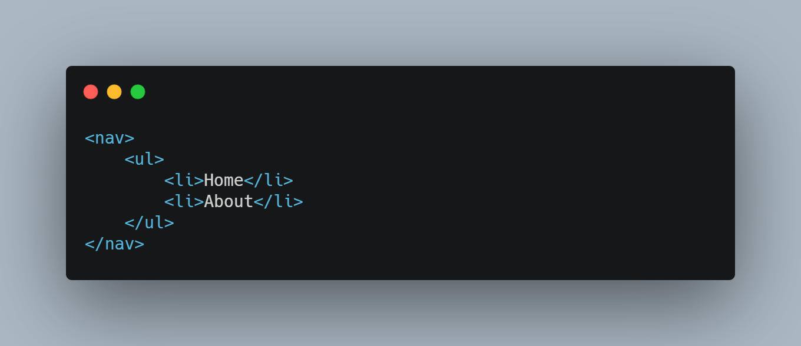
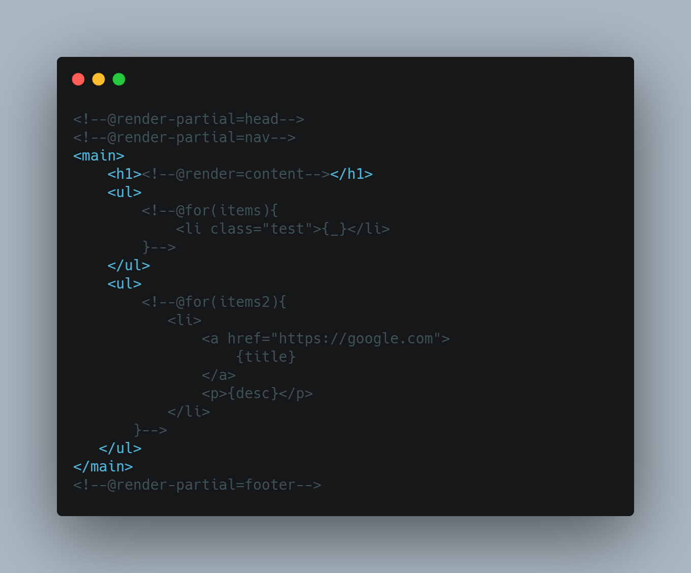
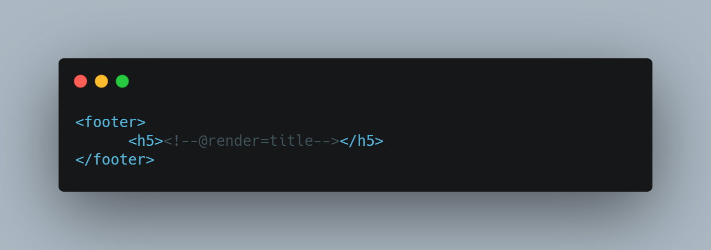
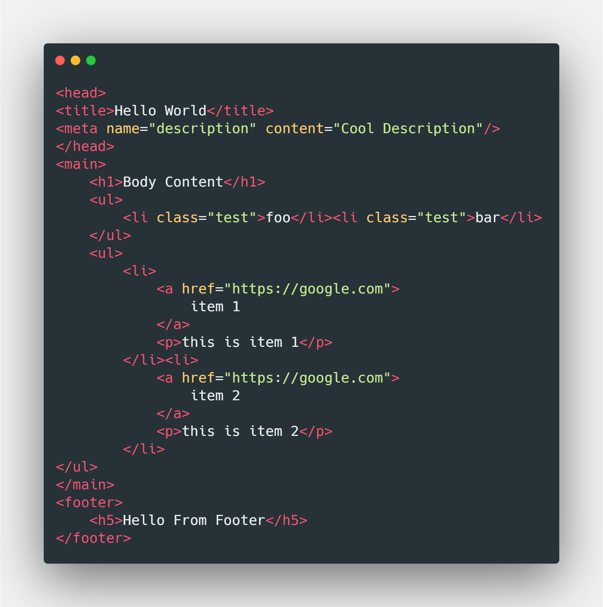

# Rendering Lists

Theoretical Server Context

You Can add as many or as few arguments to the constructor as you wish.

loaderFile

Here we could load data asynchronously and call in the return function, to load data into templates. These variables match up to the @render=variable_name directives in the views/partials segments
The partials match up to the @render-partial=partial_name directives in the views/page templates

## head.html

## nav.html

    
## home.html

## footer.html

This template takes the template, parses each partial, and outputs the following into the template from the code above

The {_} Directive in the @for loop represents the raw array item, so it works if your array only returns values into the template. If you're working with an array of objects, you can just use {propertyName} of the iterator to put that property in that segment. 

[Click here](https://github.com/abschill/html-chunk-loader/tree/master/examples) to see example integrations with the server