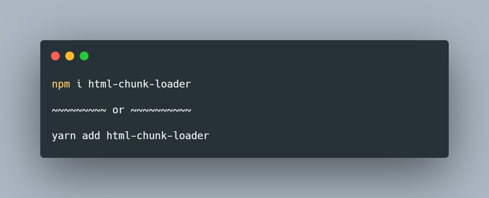

# HTML Chunk Loader
## Configurable Template Engine for Node

html-chunk-loader is a lightweight template engine for Node. It has support for ssr/ssg depending on what your goal is.

### Installation

Create a directory called views/ and inside it create pages/ and partials/ insert your chunks into these folders. Check the  directory in the github repository for an example SSR setup.

### Docs

### [Tutorial](https://github.com/abschill/html-chunk-loader/blob/master/docs/readme.md)
### [Server Side Rendering](https://github.com/abschill/html-chunk-loader/blob/master/docs/render_lists.md)
### [Static Site Generation](https://github.com/abschill/html-chunk-loader/blob/master/docs/cli.md)
### [Examples](https://github.com/abschill/html-chunk-loader/tree/master/examples)